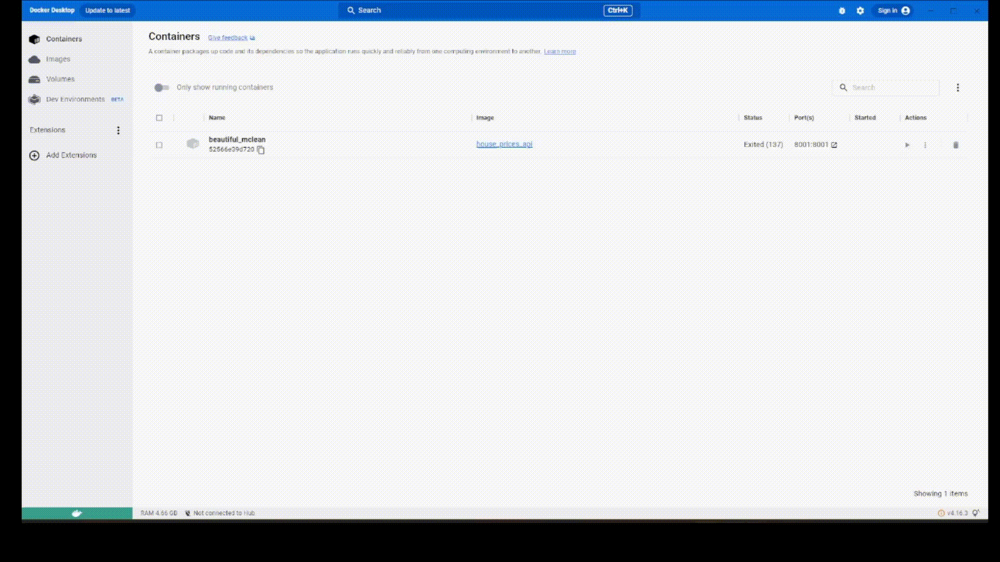

# ames-regression

In this project, I work on the [ames dataset]((https://www.kaggle.com/competitions/house-prices-advanced-regression-techniques/data)) and attempt to:
1) Develop a regression model (click the model_development folder)
2) Package and publish the developed model (click the model_package folder)
3) Turn the developed model into a service via an API (click the model_api folder)
4) Automate my workflows with continuous integration

Each folder has their respective README files to guide users who are interested in running the code / observe the results of the code.

Here is a glimpse of what the project's outcome is like:

    

